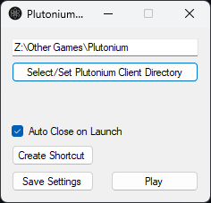

# PlutoniumPlus
A easy to use UI configurator for Plutonium

## Features
- Move Plutonium directory to anyone in one click
- Create a desktop shortcut to run from moved directory without seeing PlutoniumPlus or Plutonium launcher recreating the Appdata folder

## Instructions
- Download PlutoniumPlus.exe from the [latest release](https://github.com/TheCodingCarson/PlutoniumPlus/releases)
- Move the PlutoniumPlus.exe to anywhere you want the Plutonium directory to be (or original location)
- Run the PlutoniumPlus.exe
- (Optional) Once set to new location click "Create Shortcut" to be able to run Plutonium like it normal without seeing PlutoniumPlus!